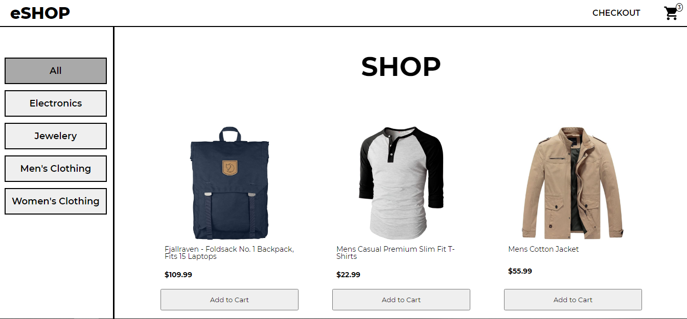

# RefugeeCentre_DevBloc_Test

## Objective

Build an e-commerce web application using React.js, here are the parameters:

1.  UI/UX (the design) IS NOT important here so do not waste your time on this.
2.  Must have a catalog page ( as in a table of products you can choose from) that are labelled and have prices
3.  Must have an add to cart button
4.  Must have a dummy checkout page where cart items are displayed

You can use any free hosting and database, there are a variety of options online.

## Tech

- Front-End: React.js, Redux
- Back-End: FakeStore API (https://github.com/keikaavousi/fake-store-api)

## Features

- Welcome Page
- Shop Page
- Cart icon that acts as: link to checkout, indicator (shows unique items in cart)
- Checkout Page (can change quantity and remove cart items)
- Checkout Page has tax/delivery breakdown
- Checkout Form has light validation (no inputs can be empty, email must have @)
- Confirmation page after the checkout is successful
- Error message when form is not filled
- Empty cart message with link to shop when cart is empty
- Categories filter based on categories
- Clean code architecture
- Easy readability of code (no regex and few ternary operators)
- Naming Standards used for easy understanding
- State management with Redux
- Checkout form data saved for figurative delivery to backend
- No sizing adjustments for different screen sizes made as requested
- Light design

# Gif Demonstration

